Benchmarking for KnowledgeGraph link Prediction Task on each specific Relational Pattern and for both inductive and transductive settings.

Details of the studied datasets:

The Results of DistMult

The Results of TransE
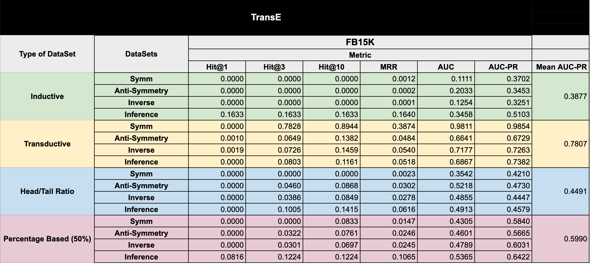

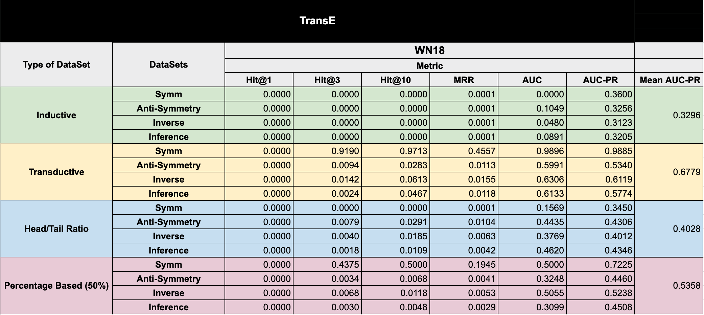

The Results of RotatE
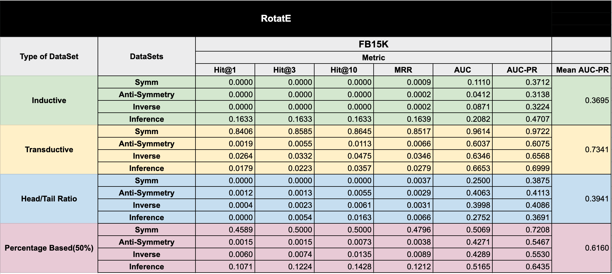

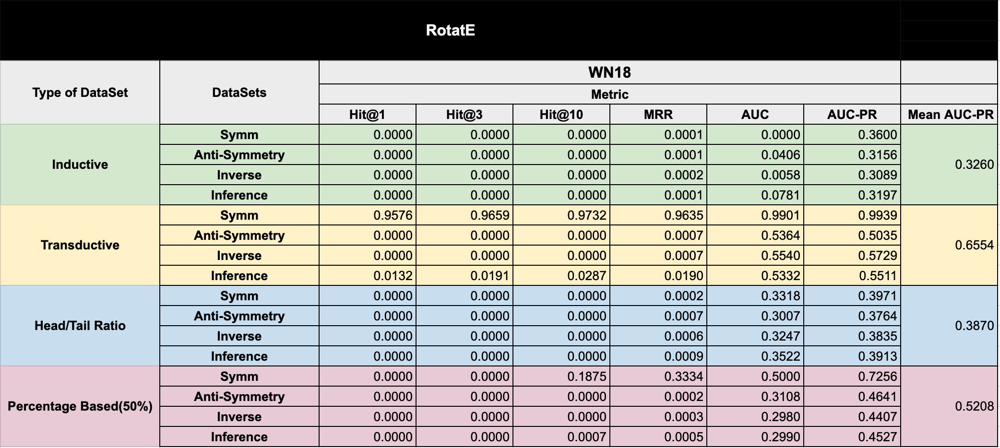

The Results of MDE
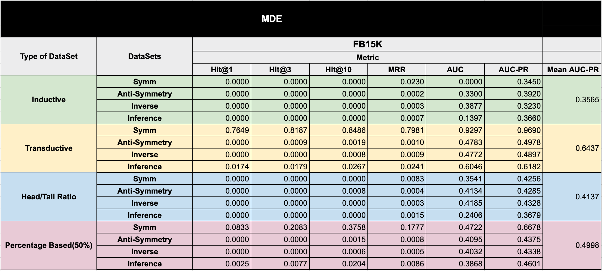

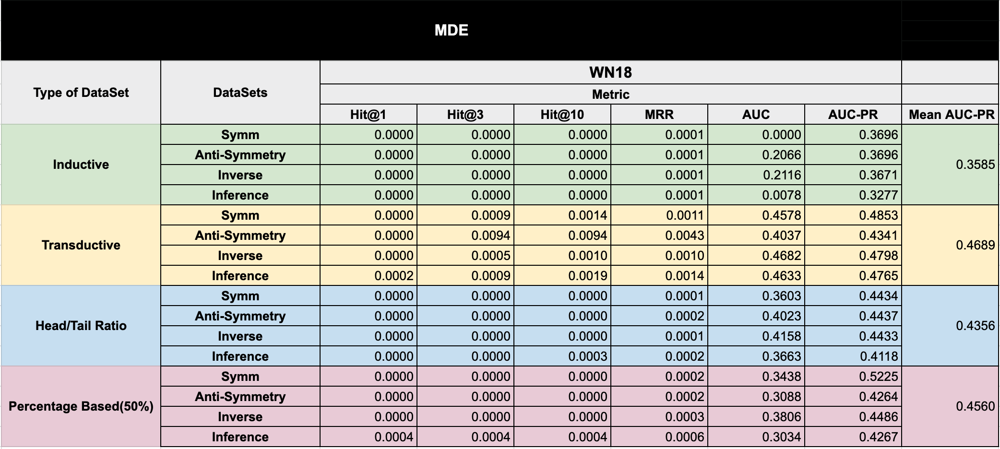

The Results of QuatE
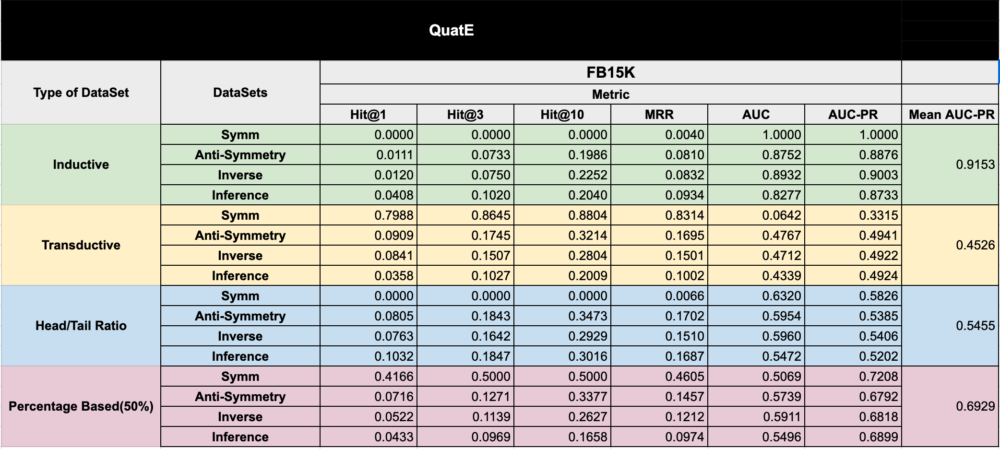

The Results of GraIL
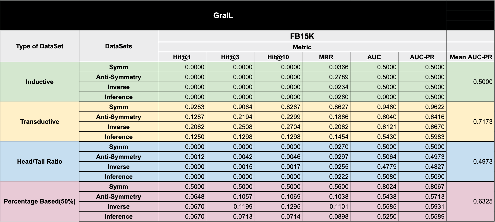

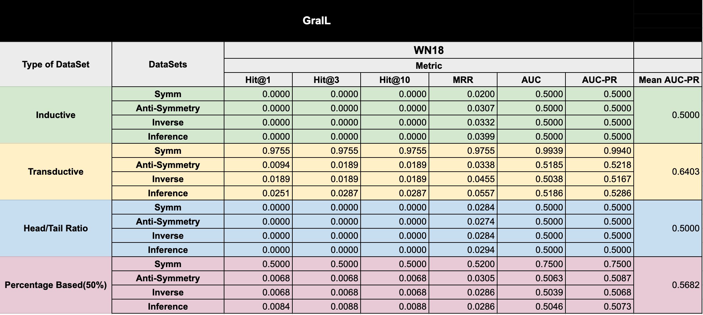

The Results of FGA-NN
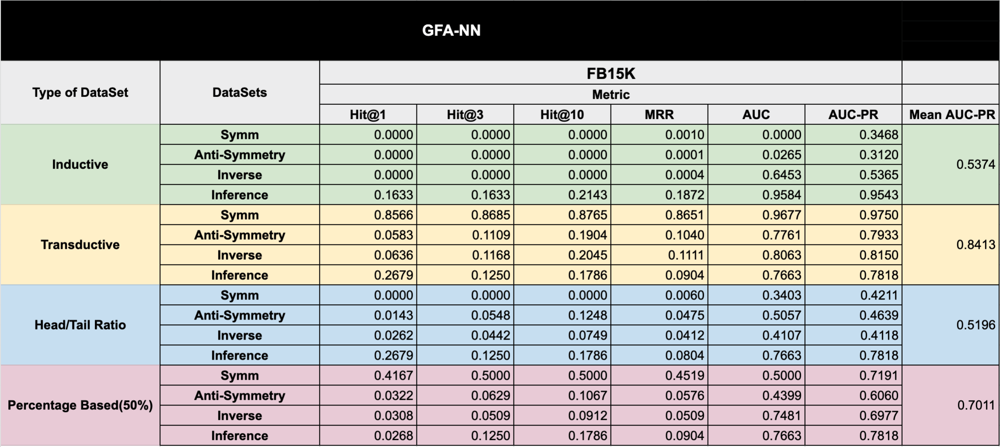

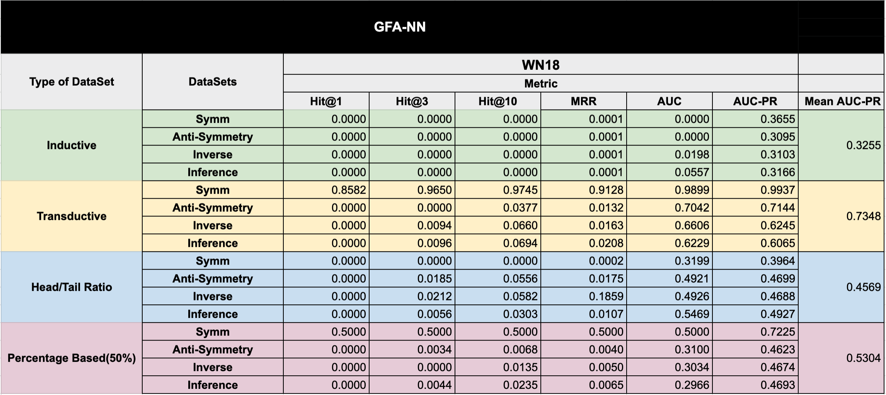

The following is index as:

1. Inductive Setting Datasets 
2. Transductive Setting Dataset
3. Train Hyperparamters 
4. Installation

## 1. Inductive Setting Datasets 

The path to induction setting datasets:

``Datasets/WN18_H/Inductive/``
``Datasets/FB15K_H/Inductive/``

## 1.1 Semi-inductive Datasets

### 1.1.1 Semi-Inductive-CountBased

They exist in ``Datasets/WN18_H/Semi-Inductive-CountBased/``
and 
in ``Datasets/FB15K_H/Semi-Inductive-CountBased/``

and each folder includes 4 subfolders for a testing a specific relational pattern: AntiSymmetry, Inference, Symmetry, Inverse.   

### 1.1.2  Semi-Inductive-Semi-Inductive-HeadOrTailBased

They exist in 
``/Datasets/WN18_H/Semi-Inductive-HeadOrTailBased/``
and 
``/Datasets/FB15K_H/Semi-Inductive-HeadOrTailBased/``

and each include 4 datasets for each test type: AntiSymmetry, Inference, Symmetry, Inverse.

## 2. Transductive Setting Dataset
They exist in ``/Datasets/FB15K_H/Transductive/`` folder and ``/Datasets/WN18_H/Transductive/``

and each folder includes 4 subfolders for a testing a specific relational pattern: AntiSymmetry, Inference, Symmetry, Inverse.   

## Code for dataset Generation
The code for generating the dataset consist of several ".py" python scripts in the folder "/utils".  

For example python ``/utils/anti-symm-extractor-fb15k.py`` command generates anti symmetric pattern dataset for fb15k dataset.

## 3. Train Hyperparamters 
The train Hyperparamters and commands used to train each model is listed in hyperparams.txt

## 4. Installation & Usage

First make sure that you have all requirements installed.
###  Requirements
- `networkx`
- `numpy` 
- `Python` 3.x
- `scipy` (somewhat recent version)
- `sklearn` (somewhat recent version)
- `torch` 1.5

## Usage
See ``https://github.com/mlwin-de/relational_pattern_benchmarking/blob/master/utils/relationalpatterns.py`` for generation of datasets and and ``https://github.com/mlwin-de/relational_pattern_benchmarking/blob/master/hyperparams.txt`` for evaluation examples. 

