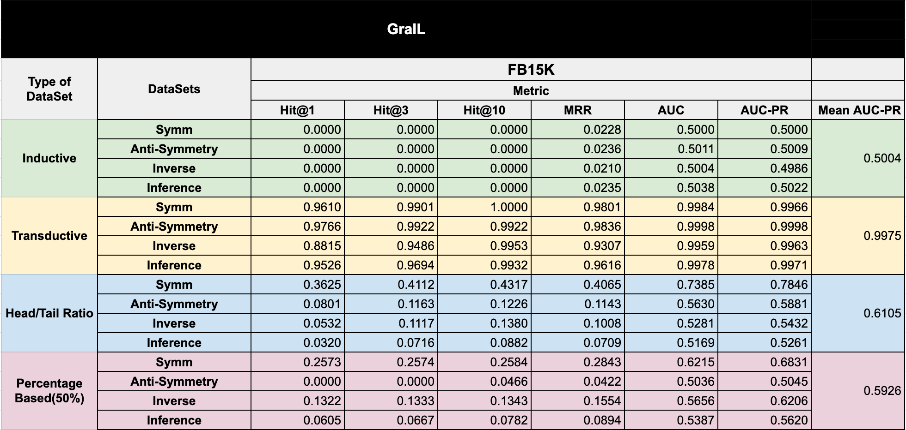

Benchmarking for KnowledgeGraph link Prediction Task on each specific Relational Pattern and for both inductive and transductive settings.


Details of the studied datasets:


The Results of DistMult


The Results of TransE


The Results of RotatE


The Results of MDE


The Results of QuatE


The Results of GraIL



The Results of GFA-NN


The following is index as:

1. Inductive Setting Datasets 
2. Transductive Setting Dataset
3. Train Hyperparamters 
4. Installation

## 1. Inductive Setting Datasets 

The path to induction setting datasets:

``Dataset/Inductive/``


## 1.1 Semi-inductive Datasets

### 1.1.1 Semi-Inductive-CountBased

They exist in ``Dataset/Semi-Inductive-CountBased/``

and folder includes 4 subfolders for a testing a specific relational pattern: AntiSymmetry, Inference, Symmetry, Inverse.   

### 1.1.2  Semi-Inductive-Semi-Inductive-HeadOrTailBased

They exist in 
``/Dataset/Semi-Inductive-HeadOrTailBased/``

and each include 4 datasets for each test type: AntiSymmetry, Inference, Symmetry, Inverse.

## 2. Transductive Setting Dataset
They exist in the folder ``/Dataset/Transductive/``.

and each folder includes 4 subfolders for a testing a specific relational pattern: AntiSymmetry, Inference, Symmetry, Inverse.   


## 3. Train Hyperparamters 
The train Hyperparamters and commands used to train each model is listed in hyperparams.txt

## 4. Installation & Usage

First make sure that you have all requirements installed.

###  Requirements for the Evaluation
- `networkx`
- `numpy` 
- `Python` 3.x
- `scipy` (somewhat recent version)
- `sklearn` (somewhat recent version)
- `torch` 1.5
- The evaluated GraIL is based on python 2.6 and its related librares corresponds to python 2.6.
- The rest of methods are compatible to python 3.9 and torch 1.10. 

### Script used for dataset Generation
The code for generating the dataset consist of several ".py" python scripts in the folder "/code"  to extract the data and evaluate it for the dataleak and extract dataset statistics.  

the file dataset_extraction_pipeline.txt contains the pipeline and the order of script executions.

 
## Contact:
Please send us the result of your methods to afshin.sadeghi at iais.fraunhofer.de on this dataset and we will share it here. We encourage using the executable version of the benchmark and the model using  [BenchEmbedd](https://github.com/mlwin-de/BenchEmbedd) which allows anybody to run methods in docker.


## Citation
If you find this code useful, please consider citing the following paper.
```
@inproceedings{sadeghi2021relational,
  title={Relational Pattern Benchmarking on the Knowledge Graph Link Prediction Task},
  author={Sadeghi, Afshin and Malik, Hirra Abdul and Collarana, Diego and Lehmann, Jens},
  booktitle={Thirty-fifth Conference on Neural Information Processing Systems Datasets and Benchmarks Track (Round 2)},
  year={2021}
}
```


